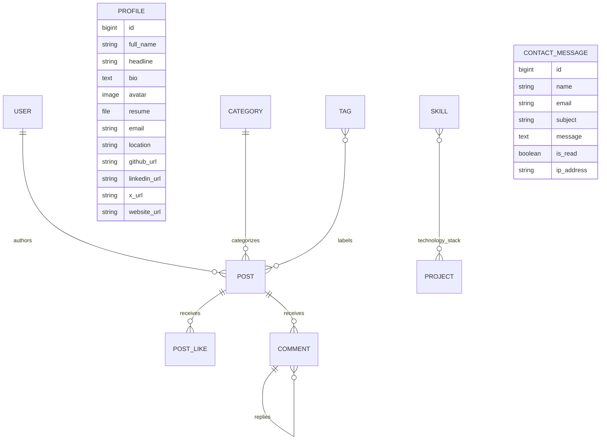

# DevFolio Portfolio & Blog API

A production-oriented REST API for a personal portfolio, technical blog, visitor interactions, contact messages, and an owner dashboard.

The API allows visitors to browse portfolio content and published blog posts, submit comments and contact messages, and toggle post likes. A single site owner manages all content through protected JWT-authenticated endpoints and Django Admin.

## Technology Stack

- Python
- Django
- Django REST Framework
- PostgreSQL
- Simple JWT
- django-filter
- django-cors-headers
- Pillow
- python-decouple
- Psycopg

## Features

### Authentication and Authorization

- JWT access and refresh tokens
- Single-owner authentication
- Only an active superuser can log in as the owner
- No public registration endpoint
- Refresh-token blacklisting during logout
- Owner password-change endpoint
- Public read access with owner-only content management
- Draft posts are hidden from visitors

### Portfolio Management

- Singleton public profile
- Skills with categories, proficiency, featured state, and display order
- Experience and education records
- Projects with screenshots, technology stack, filtering, searching, ordering, and slug-based URLs
- Absolute URLs for uploaded media

### Blog Management

- Categories and tags
- Draft and published posts
- Markdown post content
- Automatically generated unique slugs
- Automatically calculated reading time
- Published timestamps
- Featured posts
- Related posts
- Like and approved-comment counts

### Visitor Interactions

- Visitor-based like toggling
- Threaded comments and replies
- Comment approval workflow
- Comment email notification signal
- Contact-message submission
- IP-based throttling
- Duplicate-view prevention using a configurable cooldown

### Owner Dashboard

The protected dashboard endpoint returns:

- Total, published, and draft posts
- Total projects and skills
- Total views and likes
- Total and pending comments
- Unread contact messages
- Top five posts
- Five most recent comments
- Post totals for the most recent six months

### Reliability and Security

- PostgreSQL database
- Environment-based configuration
- CORS origin whitelist
- Model and serializer validation
- File extension and size validation
- Atomic database operations for likes
- Race-safe post view increments using Django `F()` expressions
- API throttling
- Paginated collections
- Request timing and logging middleware
- Automated API tests

## Local Setup

### 1. Clone the repository

```bash
git clone https://github.com/wasifibnharun/portfolio-backend.git
cd portfolio-backend
```

### 2. Create and activate a virtual environment

Windows PowerShell:

```powershell
python -m venv venv
.\venv\Scripts\Activate.ps1
```

Linux or macOS:

```bash
python3 -m venv venv
source venv/bin/activate
```

### 3. Install dependencies

```bash
python -m pip install --upgrade pip
pip install -r requirements.txt
```

### 4. Create the PostgreSQL database

Open PostgreSQL using `psql` or pgAdmin and create a database and user:

```sql
CREATE DATABASE devfolio_db;
CREATE USER devfolio_user WITH PASSWORD 'your-secure-password';
GRANT ALL PRIVILEGES ON DATABASE devfolio_db TO devfolio_user;
```

When using PostgreSQL 15 or newer, connect to `devfolio_db` and grant schema access if required:

```sql
GRANT ALL ON SCHEMA public TO devfolio_user;
```

### 5. Configure environment variables

Copy `.env.example` to `.env`:

Windows PowerShell:

```powershell
Copy-Item .env.example .env
```

Linux or macOS:

```bash
cp .env.example .env
```

Update `.env` with your local PostgreSQL credentials and a secure Django secret key.

### 6. Apply migrations

```bash
python manage.py migrate
```

### 7. Create the site owner

```bash
python manage.py createsuperuser
```

Only an active superuser can use the owner login endpoint.

### 8. Start the development server

```bash
python manage.py runserver
```

The API is available at:

```text
http://127.0.0.1:8000/api/
```

Django Admin is available at:

```text
http://127.0.0.1:8000/admin/
```

## Environment Variables

| Variable | Required | Example | Description |
|---|---:|---|---|
| `SECRET_KEY` | Yes | `replace-with-a-secure-secret` | Django cryptographic secret key |
| `DEBUG` | Yes | `True` | Enables development debug mode |
| `ALLOWED_HOSTS` | Yes | `127.0.0.1,localhost` | Comma-separated allowed hosts |
| `CORS_ALLOWED_ORIGINS` | Yes | `http://localhost:5173` | Comma-separated trusted origins |
| `CSRF_TRUSTED_ORIGINS` | Yes | `http://localhost:5173` | Origins trusted for CSRF-protected requests |
| `SECURE_SSL_REDIRECT` | No | `False` | Redirect HTTP requests to HTTPS |
| `SESSION_COOKIE_SECURE` | No | `False` | Send session cookies only over HTTPS |
| `CSRF_COOKIE_SECURE` | No | `False` | Send CSRF cookies only over HTTPS |
| `SECURE_HSTS_SECONDS` | No | `0` | HTTP Strict Transport Security duration |
| `SECURE_HSTS_INCLUDE_SUBDOMAINS` | No | `False` | Apply HSTS to subdomains |
| `SECURE_HSTS_PRELOAD` | No | `False` | Request browser HSTS preloading |
| `USE_X_FORWARDED_PROTO` | No | `False` | Trust HTTPS information from a deployment proxy |
| `DB_ENGINE` | Yes | `django.db.backends.postgresql` | Django database backend |
| `DB_NAME` | Yes | `devfolio_db` | PostgreSQL database name |
| `DB_USER` | Yes | `devfolio_user` | PostgreSQL username |
| `DB_PASSWORD` | Yes | `your-secure-password` | PostgreSQL password |
| `DB_HOST` | Yes | `127.0.0.1` | PostgreSQL host |
| `DB_PORT` | Yes | `5432` | PostgreSQL port |
| `DB_CONN_MAX_AGE` | No | `60` | Persistent DB connection lifetime |
| `POST_VIEW_COOLDOWN_SECONDS` | No | `3600` | Duplicate-view prevention period |

Never commit the real `.env` file.

For production, use:

```env
DEBUG=False
ALLOWED_HOSTS=your-api-domain.com
CORS_ALLOWED_ORIGINS=https://your-client-domain.com
```

## Authentication

Protected requests require an access token:

```http
Authorization: Bearer <access-token>
```

Access tokens expire after 15 minutes. Refresh tokens expire after seven days.

The project intentionally provides no public registration endpoint. `/api/auth/register/` returns `404 Not Found`.

## API Endpoints

### Authentication

| Method | Endpoint | Access | Description |
|---|---|---|---|
| `POST` | `/api/auth/login/` | Public | Owner login using username and password |
| `POST` | `/api/auth/refresh/` | Public | Obtain a new access token from an owner refresh token |
| `POST` | `/api/auth/logout/` | Owner | Blacklist the supplied refresh token |
| `GET` | `/api/auth/me/` | Owner | Return the authenticated owner |
| `POST` | `/api/auth/change-password/` | Owner | Change the owner password |

### Profile

| Method | Endpoint | Access | Description |
|---|---|---|---|
| `GET` | `/api/profile/` | Public | Retrieve the singleton profile |
| `PATCH` | `/api/profile/` | Owner | Update the singleton profile |

### Skills

| Method | Endpoint | Access | Description |
|---|---|---|---|
| `GET` | `/api/skills/` | Public | List, filter, search, and order skills |
| `POST` | `/api/skills/` | Owner | Create a skill |
| `GET` | `/api/skills/{id}/` | Public | Retrieve a skill |
| `PATCH` | `/api/skills/{id}/` | Owner | Update a skill |
| `DELETE` | `/api/skills/{id}/` | Owner | Delete a skill |

### Experience

| Method | Endpoint | Access | Description |
|---|---|---|---|
| `GET` | `/api/experiences/` | Public | List experience records |
| `POST` | `/api/experiences/` | Owner | Create an experience record |
| `GET` | `/api/experiences/{id}/` | Public | Retrieve an experience record |
| `PATCH` | `/api/experiences/{id}/` | Owner | Update an experience record |
| `DELETE` | `/api/experiences/{id}/` | Owner | Delete an experience record |

### Education

| Method | Endpoint | Access | Description |
|---|---|---|---|
| `GET` | `/api/education/` | Public | List education records |
| `POST` | `/api/education/` | Owner | Create an education record |
| `GET` | `/api/education/{id}/` | Public | Retrieve an education record |
| `PATCH` | `/api/education/{id}/` | Owner | Update an education record |
| `DELETE` | `/api/education/{id}/` | Owner | Delete an education record |

### Projects

| Method | Endpoint | Access | Description |
|---|---|---|---|
| `GET` | `/api/projects/` | Public | List, filter, search, and order projects |
| `POST` | `/api/projects/` | Owner | Create a project using JSON or multipart data |
| `GET` | `/api/projects/{slug}/` | Public | Retrieve a project by slug |
| `PATCH` | `/api/projects/{slug}/` | Owner | Update a project |
| `DELETE` | `/api/projects/{slug}/` | Owner | Delete a project |

### Blog Categories

| Method | Endpoint | Access | Description |
|---|---|---|---|
| `GET` | `/api/categories/` | Public | List categories with published-post counts |
| `POST` | `/api/categories/` | Owner | Create a category |
| `GET` | `/api/categories/{id}/` | Public | Retrieve a category |
| `PATCH` | `/api/categories/{id}/` | Owner | Update a category |
| `DELETE` | `/api/categories/{id}/` | Owner | Delete a category |

### Blog Tags

| Method | Endpoint | Access | Description |
|---|---|---|---|
| `GET` | `/api/tags/` | Public | List tags with published-post counts |
| `POST` | `/api/tags/` | Owner | Create a tag |
| `GET` | `/api/tags/{id}/` | Public | Retrieve a tag |
| `PATCH` | `/api/tags/{id}/` | Owner | Update a tag |
| `DELETE` | `/api/tags/{id}/` | Owner | Delete a tag |

### Blog Posts

| Method | Endpoint | Access | Description |
|---|---|---|---|
| `GET` | `/api/posts/` | Public | List published posts |
| `POST` | `/api/posts/` | Owner | Create a draft or published post |
| `GET` | `/api/posts/{slug}/` | Public | Retrieve a published post by slug |
| `PATCH` | `/api/posts/{slug}/` | Owner | Update a post |
| `DELETE` | `/api/posts/{slug}/` | Owner | Delete a post |
| `GET` | `/api/posts/?status=DRAFT` | Owner | List draft posts |
| `GET` | `/api/posts/?status=all` | Owner | List posts of every status |

Visitors cannot list or retrieve draft posts.

### Likes and Comments

| Method | Endpoint | Access | Description |
|---|---|---|---|
| `POST` | `/api/posts/{slug}/like/` | Public | Toggle a visitor’s like |
| `GET` | `/api/posts/{slug}/comments/` | Public | List approved threaded comments |
| `POST` | `/api/posts/{slug}/comments/` | Public | Submit a pending comment or reply |
| `GET` | `/api/comments/` | Owner | List comments for moderation |
| `GET` | `/api/comments/{id}/` | Owner | Retrieve a comment |
| `PATCH` | `/api/comments/{id}/` | Owner | Approve or update a comment |
| `DELETE` | `/api/comments/{id}/` | Owner | Delete a comment |

The like endpoint requires:

```http
X-Visitor-Id: a-stable-visitor-identifier
```

Visitor identifiers must not exceed 64 characters.

### Contact Messages

| Method | Endpoint | Access | Description |
|---|---|---|---|
| `POST` | `/api/contact/` | Public | Submit a contact message |
| `GET` | `/api/contact/` | Owner | List contact messages |
| `GET` | `/api/contact/{id}/` | Owner | Retrieve a contact message |
| `PATCH` | `/api/contact/{id}/` | Owner | Update the message read state |
| `DELETE` | `/api/contact/{id}/` | Owner | Delete a contact message |

### Dashboard

| Method | Endpoint | Access | Description |
|---|---|---|---|
| `GET` | `/api/dashboard/stats/` | Owner | Retrieve aggregated dashboard statistics |

## Filtering, Search, and Ordering

### Skills

```text
/api/skills/?category=BACKEND
/api/skills/?is_featured=true
/api/skills/?search=python
/api/skills/?ordering=-proficiency
```

Supported ordering fields:

- `display_order`
- `proficiency`

### Projects

```text
/api/projects/?category=FULL_STACK
/api/projects/?is_featured=true
/api/projects/?tech=Python
/api/projects/?tech=1
/api/projects/?search=portfolio
/api/projects/?ordering=-completed_date
```

Supported ordering fields:

- `completed_date`
- `display_order`

### Posts

```text
/api/posts/?category=django
/api/posts/?tag=rest-api
/api/posts/?is_featured=true
/api/posts/?search=authentication
/api/posts/?ordering=-views_count
```

Supported ordering fields:

- `published_at`
- `views_count`
- `likes_count`
- `title`

### Comment Moderation

```text
/api/comments/?is_approved=false
/api/comments/?post=my-post-slug
```

### Contact Inbox

```text
/api/contact/?is_read=false
```

## Pagination

| Resource | Page size |
|---|---:|
| Blog posts | 6 |
| Projects | 9 |
| Comments | 10 |
| Contact messages | 10 |

Paginated responses use the standard structure:

```json
{
  "count": 25,
  "next": "http://127.0.0.1:8000/api/posts/?page=2",
  "previous": null,
  "results": []
}
```

## Permission Strategy

`IsOwnerOrReadOnly` is the default API permission:

- `GET`, `HEAD`, and `OPTIONS` are public.
- Write requests require an authenticated active superuser.

`IsOwner` protects private endpoints such as:

- Owner profile information
- Logout
- Password changes
- Comment moderation
- Contact inbox
- Dashboard statistics

Anonymous write attempts return `401 Unauthorized`. Authenticated non-superusers receive `403 Forbidden`.

## Throttling

| Scope | Rate | Identity |
|---|---:|---|
| General anonymous API access | 20 requests/minute | IP address |
| Comment submission | 5 requests/hour | IP address |
| Contact submission | 3 requests/hour | IP address |
| Like toggling | 30 requests/minute | IP address |

Throttled requests return `429 Too Many Requests`.

## Post View Counter Strategy

A published post view is recorded when its detail endpoint is requested.

The API:

1. Uses `X-Visitor-Id` when provided.
2. Falls back to the visitor’s Django session key.
3. Hashes the identity before creating a cache key.
4. Stores the post and visitor combination in Django’s cache.
5. Prevents another increment until `POST_VIEW_COOLDOWN_SECONDS` expires.
6. Uses an `F()` expression for an atomic, race-safe database increment.
7. Does not count owner preview requests.
8. Does not count draft post requests.

The default cooldown is 3,600 seconds.

## Data Model



Main models:

- `Profile` — singleton portfolio owner profile
- `Skill` — categorized technical skill
- `Experience` — employment or professional history
- `Education` — academic history
- `Project` — portfolio project connected to skills
- `Category` — blog post category
- `Tag` — blog post tag
- `Post` — draft or published Markdown article
- `PostLike` — unique visitor like for a post
- `Comment` — moderated threaded comment
- `ContactMessage` — visitor contact submission

All project models inherit timestamp fields where appropriate.

## Request Timing Middleware

Every response includes an execution-time header:

```http
X-Response-Time: 12.34 ms
```

The middleware also logs:

- HTTP method
- Request path
- Response status
- Processing time

## Running Tests

Run the complete backend test suite:

```bash
python manage.py test accounts portfolio blog -v 2 --keepdb
```

Run Django’s deployment checks:

```bash
python manage.py check
python manage.py check --deploy
```

`check --deploy` should be run with production environment values such as `DEBUG=False`.

## Postman Collection

The complete Postman collection is stored in:

[DevFolio Postman collection](./postman_collection.json)

Regenerate it after changing API coverage:

```bash
python manage.py export_postman
```

The collection covers:

- Owner login and token refresh
- Public GET endpoints
- Owner-only writes for every resource
- Project and post file uploads
- Like toggling
- Comment submission and approval
- Contact-message submission
- Dashboard statistics
- Authentication and authorization acceptance cases

## Repository Links

- Backend repository: `https://github.com/wasifibnharun/portfolio-backend.git`
- Postman collection: [postman_collection.json](./postman_collection.json)

## License

This project was created for educational and portfolio purposes.